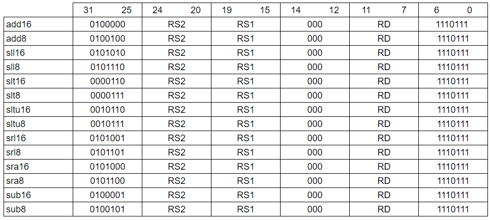
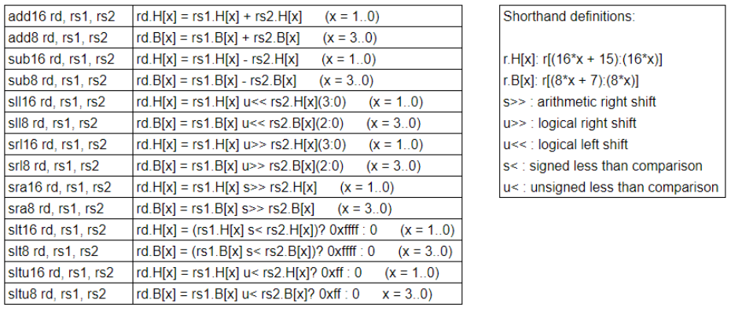
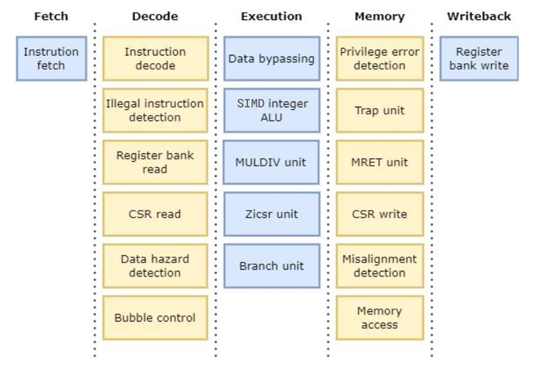
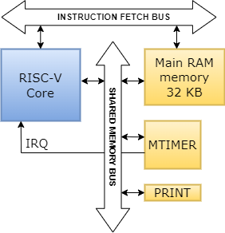

# riscv-vhdl

This project is based on a VHDL implementation of a 5 stage RISC-V CPU with support for the RV32I Base Integer Instruction Set, M Standard Extension for Integer
Multiplication and Division, Zicsr Control and Status Register
(CSR) Instructions, Machine mode and User mode. This base CPU design can be found in . This base CPU design has been modified to support a custom SIMD extension.

This project contains an automated set of tests for the instructions and extensions implemented. It was created using unit tests from [riscv-software-src/riscv-tests](https://github.com/riscv-software-src/riscv-tests).

It also contains an automated set of benchmarks to compare between a version that uses the 
instructions of the new SIMD extension and a version that don't uses them.

This project also contains a simple example program written in C with a set of utils for its compilation and simulation.

## Software requirements

- [GHDL 2.0](https://github.com/ghdl/ghdl), an open-source analyzer, compiler and simulator for VHDL. The backend version of ghdl used in this project is llvm.
- The [RISC-V GNU Compiler Toolchain 12.2](https://github.com/riscv-collab/riscv-gnu-toolchain) for cross-compiling. Additionally, it is necessary to modify the GNU Compiler to recognise the new instructions of the custom SIMD extension by modifying two files: <em>riscv-gnu-toolchain/binutils/opcodes/riscv-opc.c</em> and <em>riscv-gnu-toolchain/binutils/include/opcode/riscv-opc.h</em>. You can get the files for this project in <em>riscv-compiler-files</em> directory.
- Python 3.10
  - [Pyelftools](https://github.com/eliben/pyelftools) for ELF file parsing.

## SIMD extension specification

The specification of the SIMD extension implemented is based on [RISC-V "P" Extension Proposal](https://github.com/riscv/riscv-p-spec/blob/master/P-ext-proposal.pdf)

The SIMD extension is composed of the following 14 instructions: 
    - ADD16
    - ADD8
    - SLL16
    - SLL8
    - SLT16
    - SLT8
    - SLTU16
    - SLTU8
    - SRL16
    - SRL8
    - SRA16
    - SRA8
    - SUB16
    - SUB8

The following diagram shows the codification format of the 14 instructions.

The following diagrama shows how each instruction works.

## CPU design

The following diagram shows the set of actions that are performed in each stage of the pipeline.

## System Design

The following diagram shows the design of the system.

The ``MTIMER`` device is the standard RISC-V timer.

The ``PRINT`` MMIO device every time a store is issued to its address executes an VHDL report that prints to the standard output of the simulation the value of the store.

The VHDL source files of the whole system can be found at ``vhdl_src/src``.

## Compilation and linking

The compilation flags for ``riscv32-unknown-elf-gcc`` required for this platform are:

    -march=rv32im_zicsr -mabi=ilp32

The linking must be done using a linking script that respects the memory size and map of the platform. Valid scripts can be found at ``c_src/linker.lds`` and ``tests/linker.lds``.

## VHDL Ram files

The simulation runs the program that is loaded in the VHDL ram files ``vhdl_src/src/B_RAM_[0-3].vhd``. A new program can be loaded using the ``common/elf.py`` script, it extracts the instructions and data from an ELF executable file and creates the new ram files.

## Simulation

The ``vhdl_src/scripts`` directory contains scripts for GHDL compilation and simulation and a ``term.py`` script that parses the reports of the ``PRINT`` MMIO device as ASCII characters.

To start a simulation of the program loaded in the ram files run in the ``vhdl_src`` directory:

    $ make sim

This simulation stops when it reaches 8000 us of simulated time. 

## Testing

The ``tests`` directory contains the source files of the test programs and the ``exec_test.sh`` script. To execute all tests run in the ``tests`` directory:

    $ ./exec_test.sh

To execute only the tests which name match a certain regular expression run:

    $ ./exec_test.sh REGEX

## Benchmarks

The ``benchmarks`` directory contains the source files of the benchmarks programs and the ``exec_benchmarks.sh`` script. To execute all benchmarks run in the ``benchmarks`` directory:

    $ ./exec_benchmarks.sh

## C Example

The ``c_src/src`` and ``c_src/include`` contain the source files and headers of a simple "Hello World!" program written in C. 

The ``c_src/sim.sh`` script compiles the C program using the ``c_src/Makefile``, generates its VHDL ram files and simulates its execution until it reaches a limit of simulated time. It can be executed by running in the ``c_src`` directory:

    $ ./sim.sh TIME_LIMIT

If the script is called without the ``TIME_LIMIT`` parameter the simulation never ends.
